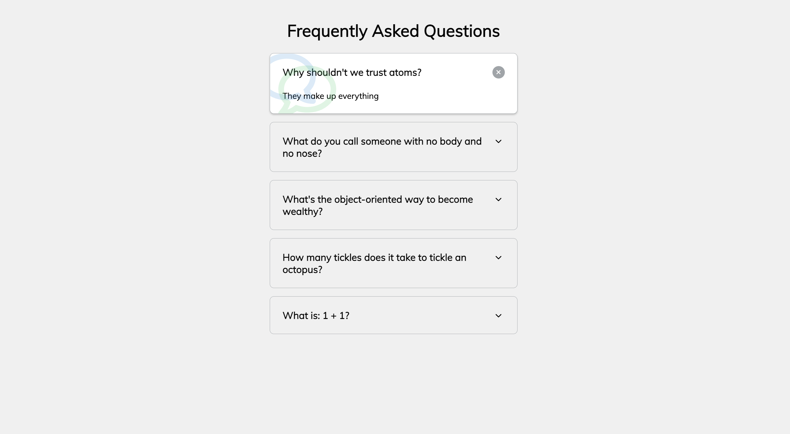

# 50 Projects in 50 Days - Faq Collapse

This is a code along project in the [50 Projects In 50 Days - HTML, CSS & JavaScript Udemy Course](https://www.udemy.com/course/50-projects-50-days/). Sharpen your skills by building 50 quick, unique & fun mini projects.

## Table of contents 😌

- [Overview](#overview)
  - [The project](#the-project)
  - [Screenshot](#screenshot)
  - [Links](#links)
- [My process](#my-process)
  - [Built with](#built-with)
  - [What I learned](#what-i-learned)
  - [Continued development](#continued-development)
  - [Code snippets](#im-really-proud-of-these-code-snippets%EF%B8%8F)
  - [Useful resources](#useful-resources)
- [Author](#author)
- [Acknowledgments](#acknowledgments)

## Overview👋🏾

Welcome to the 12<sup>th</sup> mini-project of the course!

### The project😥

In this project users will be able to:

- Build collapsible cards that toggle between classes to determine what to display.

### Screenshot🌇



### Links👩🏾‍💻

- Solution URL: (https://github.com/MaianneThornton/50in50_FaqCollapse)
- Live Site URL: (https://effervescent-gecko-38c928.netlify.app/)

## My process💭

This is a simple project that I started by marking out initial classes in html to be later used for styling. Next I began styling the css by styling the cards and buttons. I then added functionality by way of JavaScript to switch between classes when the user clicks on a button.

### Built with👷🏾‍♀️

- Semantic HTML5 markup
- CSS custom properties
- Flexbox
- JavaScript

### What I learned👩🏾‍🏫

I learned how to add font awesome icons in css via their unicode values.

I also learned that when using the before or after selectors you MUST add 'content' for the style to be visible. In this case this is where I was able to place the unicode for the font-awesome icon.

### Continued development🔮

In the future I plan on continuing to using different pseudo selectors such as before and after to select and style elements.

I also plan on continuing to practice using event listeners to make my pages more functional.

I also plan on continuing to learn the best ways to phrase git commits, so that future viewers can fully understand the changes that have occurred.

### I'm really proud of these code snippets✂️

```css
.faq.faq.active::before,
.faq.faq.active::after {
  content: '\f075';
  font-family: 'Font Awesome 5 Free';
  color: #2ecc71;
  font-size: 7rem;
  position: absolute;
  opacity: 0.2;
  top: 20px;
  left: 20px;
  z-index: 0;
}

.faq.faq.active::before {
  color: #3498db;
  top: -10px;
  left: -30px;
  transform: rotateY(180deg);
}
```

```js
const toggling = document.querySelectorAll('.faq-toggle')

toggling.forEach(toggle => {
    toggle.addEventListener('click', () => {
        toggle.parentNode.classList.toggle('active')
    })
})
```

### Useful resources📖

- [Resource](https://fontawesome.com/v5/docs/web/advanced/css-pseudo-elements) - This an article which details how to use font-awesome icons in css via their unicode.

## Author🔎

- Website - [Portfolio Site](https://www.maiannethornton.com/Portfolio/index.html)
- Frontend Mentor - [@MaianneThornton](https://www.frontendmentor.io/profile/MaianneThornton)
- GitHub - [@MaianneThornton](GitHub.com/MaianneThornton)
- Twitter - [@MaianneThornton](https://twitter.com/MaianneThornton)
- LinkedIn - [@MaianneThornton](https://www.linkedin.com/in/maiannethornton/)

## Acknowledgments🙏🏾

Special Thanks go to [Brad Traversy](http://www.traversymedia.com/) and [Florin Pop](http://www.florin-pop.com/) creating the course and making reviewing concepts fun 😊.
